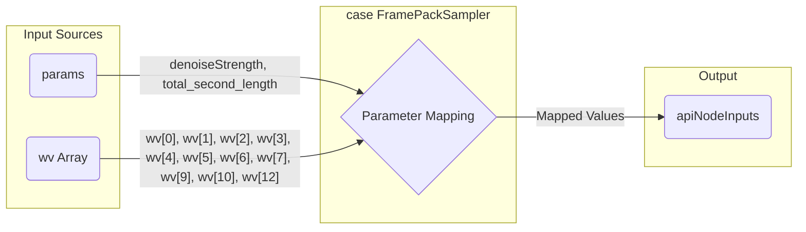

# `src/services/api.ts` (FramePackSampler ケース) のコード説明

`src/services/api.ts` ファイル内の `buildVideoWorkflow` 関数における `FramePackSampler` ケース (ID: 39) のコードスニペットについての最新の説明です。

```typescript
      case "FramePackSampler": { // ID 39
        // ユーザー提供のJSONとテンプレート(wv)に合わせてパラメータを設定
        apiNodeInputs["steps"] = wv[0];                            // wv[0] (30)
        apiNodeInputs["use_teacache"] = wv[1];                     // wv[1] (true)
        apiNodeInputs["denoise_strength"] = params.denoiseStrength; // UI (params) より
        apiNodeInputs["guidance_scale"] = wv[4];                   // wv[4] (10)
        apiNodeInputs["cfg"] = wv[3];                            // wv[3] (1)
        apiNodeInputs["teacache_rel_l1_thresh"] = wv[2];           // wv[2] (0.15)
        apiNodeInputs["seed"] = wv[6];                            // wv[6] (213738928831015)
        apiNodeInputs["shift"] = wv[5];                            // wv[5] (1.000...)
        apiNodeInputs["latent_window_size"] = wv[7];               // wv[7] (9)
        apiNodeInputs["gpu_memory_preservation"] = wv[9];          // wv[9] (6)
        apiNodeInputs["sampler"] = wv[10];                         // wv[10] ("unipc_bh1")
        apiNodeInputs["total_second_length"] = params.total_second_length; // UI (params) より
        apiNodeInputs["keyframe_weight"] = wv[12];                 // wv[12] (1.5) - 新規追加
        break;
      } // Add closing brace
```

## 1. コードの目的と機能

このコードブロックは、`switch` 文の一部であり、`FramePackSampler` という名前のサンプラーが選択された場合に実行されます。主な目的は、動画生成タスクを実行するバックエンド API に送信するためのパラメータ群 (`apiNodeInputs`) を設定することです。

具体的には、主にワークフローテンプレート (`videoWorkflowTemplate.json`) のウィジェット値 (`wv` 配列) から取得した値と、一部ユーザーインターフェース (`params`) から取得した値を使って、`FramePackSampler` に固有の様々な設定項目を `apiNodeInputs` オブジェクトに格納しています。

## 2. 主要なコンポーネントとその相互作用

* **`switch` 文:** ある変数の値に基づいて、実行するコードブロックを分岐させます。ここでは、サンプラーの種類によって処理を分けています。
* **`case "FramePackSampler":`:** `switch` 文の中で、サンプラー名が `"FramePackSampler"` である場合に、このブロック内のコードが実行されます。
* **`apiNodeInputs`:** API リクエストのペイロード（送信データ）を構築するためのオブジェクトです。このコードブロック内で、キーと値のペアとしてパラメータが追加・設定されます。
* **`params`:** ユーザーインターフェース（UI）から渡された設定値を含むオブジェクトです。このブロックでは `params.denoiseStrength` と `params.total_second_length` が利用されています。
* **`wv`:** Workflow Values の略と思われ、`videoWorkflowTemplate.json` から読み込まれたワークフロー定義内の `FramePackSampler` ノードの `widgets_values` 配列です。インデックス (`wv[0]`, `wv[1]` など) を使って特定の値にアクセスしています。
* **パラメータ設定ロジック:**
  * **テンプレート値 (`wv`) からの直接割り当て:** ほとんどのパラメータ (`steps`, `use_teacache`, `guidance_scale`, `cfg`, `teacache_rel_l1_thresh`, `seed`, `shift`, `latent_window_size`, `gpu_memory_preservation`, `sampler`, `keyframe_weight`) は、`wv` 配列の特定のインデックスから直接値を取得して `apiNodeInputs` に割り当てられます。
  * **UI 値 (`params`) からの直接割り当て:** `denoise_strength` と `total_second_length` は、UI から渡された `params` オブジェクトの値が `apiNodeInputs` に割り当てられます。

## 3. 重要なパターンやテクニック

* **パラメータマッピング:** 異なるソース (`wv`, `params`) からのデータを、API が期待する形式 (`apiNodeInputs` のキーと値) に変換・対応付けています。特に、`wv` 配列のインデックスと API パラメータ名の対応関係が重要です。
* **設定の集約:** 特定の機能（ここでは `FramePackSampler`）に関連する設定を一つのオブジェクト (`apiNodeInputs`) にまとめています。
* **インデックスベースのアクセス:** `wv` 配列のように、インデックス番号で値にアクセスしています。これは簡潔ですが、インデックスの意味がコードを読むだけでは分かりにくいため、テンプレートファイル (`videoWorkflowTemplate.json`) との対応関係を理解することが不可欠です。

## Mermaid 図によるパラメータフローの可視化



---

## `wv` 変数の出所について

コード内で使用されている `wv` 変数は、`src/services/api.ts` ファイル内の `buildVideoWorkflow` 関数 (334行目開始) で定義されています。

```typescript
339 |   const workflow = JSON.parse(
340 |     JSON.stringify(videoWorkflowTemplate) // videoWorkflowTemplate.json を読み込む
341 |   ) as Workflow;
// ...
344 |   workflow.nodes.forEach((node) => { // 各ノードをループ処理
// ...
351 |     const wv = node.widgets_values || []; // ノードの widgets_values を wv に代入
// ...
354 |     switch (node.type) { // ノードタイプに応じて wv の値を使用
// ...
```

具体的には、以下の流れで値が取得されます。

1. `videoWorkflowTemplate.json` という JSON ファイルがインポートされます (7行目)。このファイルには、ComfyUI の動画生成ワークフローの構造（ノード、接続、各ノードの初期設定値など）が定義されています。
2. `buildVideoWorkflow` 関数内で、この JSON データがパースされ、`workflow` オブジェクトが作成されます (339-341行目)。
3. `workflow.nodes.forEach` ループ (344行目) で、ワークフロー内の各ノード (`node`) が順番に処理されます。
4. 各ノードの処理の開始時に、`const wv = node.widgets_values || [];` (351行目) という行で `wv` 変数が定義されます。
    * `node.widgets_values` は、そのノードに設定されているウィジェット（UI 上のスライダー、数値入力、トグルボタンなど）の現在の値（またはデフォルト値）を保持する配列です。
    * もし `widgets_values` が存在しない場合（ノードにウィジェットがないなど）は、空の配列 `[]` が `wv` に代入されます。
5. その後の `switch` 文 (354行目) では、ノードの種類 (`node.type`) に応じて、`wv` 配列の特定のインデックス (`wv[0]`, `wv[1]` など) にアクセスし、API に送信するパラメータ (`apiNodeInputs`) を設定しています。

したがって、**`wv` は `videoWorkflowTemplate.json` に定義されたワークフローの各ノードが持つウィジェットの値（設定値）の配列** を参照しています。

---

## `use_teacache` と `videoWorkflowTemplate.json` について

`videoWorkflowTemplate.json` ファイル内の `FramePackSampler` ノード (ID: 39) の `widgets_values` 配列の中に `"use_teacache"` という文字列自体は含まれていません。

`api.ts` のコード:

```typescript
apiNodeInputs["use_teacache"] = wv[1];
```

このコードは、`widgets_values` 配列 (`wv`) の **インデックス 1** にある値を、API に送信する際の `use_teacache` パラメータとして使用するという意味です。

`videoWorkflowTemplate.json` の該当箇所 (456-470行目) を見ると、`FramePackSampler` (ID: 39) の `widgets_values` は以下のようになっています。

```json
      "widgets_values": [
        30,     // Index 0
        true,   // Index 1 <<< この値が使われます
        0.15,   // Index 2
        1,      // Index 3
        // ... 以下続く ...
      ]
```

つまり、JSON テンプレートでは `use_teacache` に対応する値として `true` が **位置 (インデックス 1)** によって指定されており、`api.ts` のコードがその位置にある値を読み取って `use_teacache` パラメータに割り当てています。

このように、`api.ts` は JSON テンプレート内の値の **順序・位置** に依存して API パラメータを構築しています。

---

## `denoise_strength` パラメータについて (更新)

以前の説明とは異なり、最新のコードでは `denoise_strength` パラメータが `FramePackSampler` ノード (ID: 39) に対して設定されるようになりました。

`api.ts` のコード:

```typescript
apiNodeInputs["denoise_strength"] = params.denoiseStrength; // UI (params) より
```

このコードは、ユーザーインターフェース (UI) から渡された `params` オブジェクト内の `denoiseStrength` の値を、API に送信する際の `denoise_strength` パラメータとして使用します。

この変更により、UI 上で設定された `denoiseStrength` の値が、動画生成時に `FramePackSampler` に反映されるようになりました。
