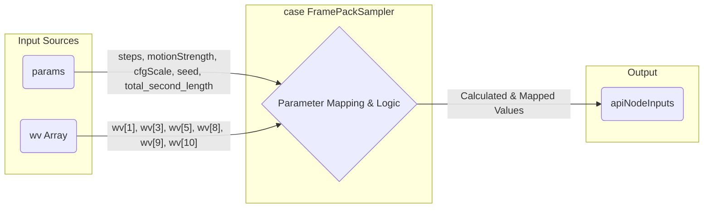

# `src/services/api.ts` (396-418行目) のコード説明

指定された `src/services/api.ts` の 396行目から418行目のコードスニペットについての説明です。

```typescript
   break;
      case "FramePackSampler": { // 396行目: FramePackSampler のケースを開始
        // ID 39 - Add braces
        apiNodeInputs["steps"] = params.steps; // 398行目: ステップ数を設定
        apiNodeInputs["use_teacache"] = wv[1]; // 399行目: teacache の使用有無を設定 (wv配列の1番目の要素)
        apiNodeInputs["motion_strength"] = params.motionStrength; // 400行目: モーション強度を設定
        apiNodeInputs["guidance_scale"] = wv[3]; // 401行目: ガイダンススケールを設定 (wv配列の3番目の要素)
        apiNodeInputs["cfg"] = params.cfgScale; // 402行目: CFGスケールを設定
        const threshValue = typeof wv[5] === "number" ? wv[5] : 0.15; // 403行目: wv[5]が数値ならその値、そうでなければ0.15を threshValue に設定
        apiNodeInputs["teacache_rel_l1_thresh"] = Math.min(1.0, threshValue); // 404行目: teacacheの閾値を設定 (threshValue と 1.0 の小さい方)
        apiNodeInputs["seed"] = // 405行目: シード値を設定
          params.seed < 0 // 406行目: params.seed が負の場合
            ? Math.floor(Math.random() * 2147483647) // 407行目: ランダムな整数を生成
            : params.seed; // 408行目: そうでなければ params.seed を使用
        // shift: Use default float value 0.0 instead of string "increment"
        apiNodeInputs["shift"] = 0.0; // 410行目: shift 値を 0.0 に固定 (コメントによると元の "increment" は無効)
        apiNodeInputs["latent_window_size"] = wv[8]; // 411行目: 潜在空間のウィンドウサイズを設定 (wv配列の8番目の要素)
        apiNodeInputs["gpu_memory_preservation"] = wv[9]; // 412行目: GPUメモリ節約設定 (wv配列の9番目の要素)
        // apiNodeInputs["teacache_batch_size"] = wv[10]; // Assuming this is correct index (コメントアウトされている)
        apiNodeInputs["sampler"] = wv[10]; // 414行目: 使用するサンプラーを設定 (wv配列の10番目の要素)
        apiNodeInputs["total_second_length"] = params.total_second_length; // 415行目: 合計秒数を設定
        break; // 416行目: switch 文を抜ける
      } // 417行目: FramePackSampler のケースを終了
```

## 1. コードの目的と機能

このコードブロックは、`switch` 文の一部であり、特定の条件、すなわち `FramePackSampler` という名前のサンプラーが選択された場合に実行されます。主な目的は、画像生成や動画生成などのタスクを実行するバックエンドAPIに送信するためのパラメータ群 (`apiNodeInputs`) を設定することです。

具体的には、ユーザーインターフェース (`params`) や、おそらくワークフロー定義や事前設定 (`wv` 配列) から取得した値を使って、`FramePackSampler` に固有の様々な設定項目（ステップ数、シード値、ガイダンススケール、モーション強度など）を `apiNodeInputs` オブジェクトに格納しています。

## 2. 主要なコンポーネントとその相互作用

* **`switch` 文:** ある変数の値に基づいて、実行するコードブロックを分岐させます。ここでは、サンプラーの種類によって処理を分けています。
* **`case "FramePackSampler":`:** `switch` 文の中で、サンプラー名が `"FramePackSampler"` である場合に、このブロック内のコードが実行されます。
* **`apiNodeInputs`:** API リクエストのペイロード（送信データ）を構築するためのオブジェクトです。このコードブロック内で、キーと値のペアとしてパラメータが追加・設定されます。
* **`params`:** おそらくユーザーインターフェース（UI）から渡された設定値を含むオブジェクトです。`params.steps`、`params.motionStrength`、`params.cfgScale`、`params.seed`、`params.total_second_length` などが利用されています。
* **`wv`:** Workflow Values の略と思われ、ワークフロー定義や他の設定ソースから取得した値を含む配列です。インデックス (`wv[1]`, `wv[3]` など) を使って特定の値にアクセスしています。どのインデックスがどのパラメータに対応するかは、このコードの外側の定義に依存します。
* **パラメータ設定ロジック:**
  * **直接割り当て:** `params` や `wv` の値を直接 `apiNodeInputs` の対応するキーに割り当てています (例: `apiNodeInputs["steps"] = params.steps;`)。
  * **条件付き割り当て (三項演算子):**
    * `teacache_rel_l1_thresh`: `wv[5]` が数値かどうかを確認し、数値ならその値を、そうでなければデフォルト値 `0.15` を使用します。さらに `Math.min` を使って値が `1.0` を超えないように制限しています。
    * `seed`: `params.seed` が負の値（おそらくランダムシードを示す）の場合、`Math.random()` を使ってランダムな整数を生成し、そうでなければ `params.seed` の値をそのまま使用します。
  * **固定値割り当て:** `apiNodeInputs["shift"] = 0.0;` のように、特定のパラメータに固定値を設定しています。コメントによると、これは元の値 `"increment"` がAPIにとって無効な形式であるため、数値 `0.0` に置き換えています。

## 3. 重要なパターンやテクニック

* **パラメータマッピング:** 異なるソース (`params`, `wv`) からのデータを、API が期待する形式 (`apiNodeInputs` のキーと値) に変換・対応付けています。これは、UI やワークフロー定義とバックエンド API のインターフェースを接続する際の一般的なパターンです。
* **設定の集約:** 特定の機能（ここでは `FramePackSampler`）に関連する設定を一つのオブジェクト (`apiNodeInputs`) にまとめています。
* **デフォルト値とフォールバック:** `teacache_rel_l1_thresh` や `seed` の設定に見られるように、入力値が無効または存在しない場合に備えて、デフォルト値や代替ロジック（ランダム値生成）を用意しています。これにより、コードの堅牢性が向上します。
* **インデックスベースのアクセス:** `wv` 配列のように、インデックス番号で値にアクセスしています。これは簡潔ですが、インデックスの意味がコードを読むだけでは分かりにくい場合があるため、注意が必要です（コメントや外部ドキュメントが重要になります）。
* **コメントによる意図の説明:** `shift` パラメータの設定理由など、コードだけでは分かりにくい意図や背景をコメントで補足しています。

## Mermaid 図によるパラメータフローの可視化



---

## `wv` 変数の出所について

コード内で使用されている `wv` 変数は、`src/services/api.ts` ファイル内の `buildVideoWorkflow` 関数 (334行目開始) で定義されています。

```typescript
339 |   const workflow = JSON.parse(
340 |     JSON.stringify(videoWorkflowTemplate) // videoWorkflowTemplate.json を読み込む
341 |   ) as Workflow;
// ...
344 |   workflow.nodes.forEach((node) => { // 各ノードをループ処理
// ...
351 |     const wv = node.widgets_values || []; // ノードの widgets_values を wv に代入
// ...
354 |     switch (node.type) { // ノードタイプに応じて wv の値を使用
// ...
```

具体的には、以下の流れで値が取得されます。

1.  `videoWorkflowTemplate.json` という JSON ファイルがインポートされます (7行目)。このファイルには、ComfyUI の動画生成ワークフローの構造（ノード、接続、各ノードの初期設定値など）が定義されています。
2.  `buildVideoWorkflow` 関数内で、この JSON データがパースされ、`workflow` オブジェクトが作成されます (339-341行目)。
3.  `workflow.nodes.forEach` ループ (344行目) で、ワークフロー内の各ノード (`node`) が順番に処理されます。
4.  各ノードの処理の開始時に、`const wv = node.widgets_values || [];` (351行目) という行で `wv` 変数が定義されます。
    *   `node.widgets_values` は、そのノードに設定されているウィジェット（UI 上のスライダー、数値入力、トグルボタンなど）の現在の値（またはデフォルト値）を保持する配列です。
    *   もし `widgets_values` が存在しない場合（ノードにウィジェットがないなど）は、空の配列 `[]` が `wv` に代入されます。
5.  その後の `switch` 文 (354行目) では、ノードの種類 (`node.type`) に応じて、`wv` 配列の特定のインデックス (`wv[0]`, `wv[1]` など) にアクセスし、API に送信するパラメータ (`apiNodeInputs`) を設定しています。

したがって、**`wv` は `videoWorkflowTemplate.json` に定義されたワークフローの各ノードが持つウィジェットの値（設定値）の配列** を参照しています。

---

## `use_teacache` と `videoWorkflowTemplate.json` について

ご指摘の通り、`videoWorkflowTemplate.json` ファイル内の `FramePackSampler` ノード (ID: 39) の `widgets_values` 配列の中に `"use_teacache"` という文字列自体は含まれていません。

`api.ts` のコード (400行目):

```typescript
apiNodeInputs["use_teacache"] = wv[1];
```

このコードは、`widgets_values` 配列 (`wv`) の **インデックス 1** にある値を、API に送信する際の `use_teacache` パラメータとして使用するという意味です。

`videoWorkflowTemplate.json` の該当箇所 (456-470行目) を見ると、`FramePackSampler` (ID: 39) の `widgets_values` は以下のようになっています。

```json
      "widgets_values": [
        30,     // Index 0
        true,   // Index 1 <<< この値が使われます
        0.15,   // Index 2
        1,      // Index 3
        // ... 以下続く ...
      ]
```

つまり、JSON テンプレートでは `use_teacache` に対応する値として `true` が **位置 (インデックス 1)** によって指定されており、`api.ts` のコードがその位置にある値を読み取って `use_teacache` パラメータに割り当てています。

このように、`api.ts` は JSON テンプレート内の値の **順序・位置** に依存して API パラメータを構築しています。

---

## `denoise_strength` パラメータについて

`denoise_strength` パラメータは、分析対象となっている `src/services/api.ts` の `buildVideoWorkflow` 関数内で `FramePackSampler` ノード (ID: 39) に対して **明示的に設定されていません**。

`FramePackSampler` のケース (397-418行目) で設定されているパラメータを確認しても、`denoise_strength` に直接対応するものは見当たりません。また、`videoWorkflowTemplate.json` の `FramePackSampler` ノード定義にも、`denoise_strength` に対応するウィジェット値や入力リンクは存在しません。

代わりに、このワークフローでは `motion_strength` というパラメータが UI (`params`) から取得され、`FramePackSampler` に設定されています (401行目)。

```typescript
apiNodeInputs["motion_strength"] = params.motionStrength;
```

動画生成、特に `FramePackSampler` を使用する場合、この `motion_strength` パラメータが、生成される動画が初期画像やプロンプトに対してどれだけ忠実であるか（またはどれだけ変化を許容するか）を制御する役割を担っていると考えられます。これは、画像生成における `denoise_strength` と似たような概念を扱っている可能性があります。

参考として、同じ `api.ts` ファイル内の画像生成用ワークフローを構築する `buildWorkflow` 関数 (233行目開始) では、`KSampler` ノードに対して `denoise: params.denoiseStrength` (270行目) という形で `denoise_strength` が使用されています。これは、ワークフローの種類や使用するサンプラーによって、利用可能なパラメータやその名前が異なることを示唆しています。
