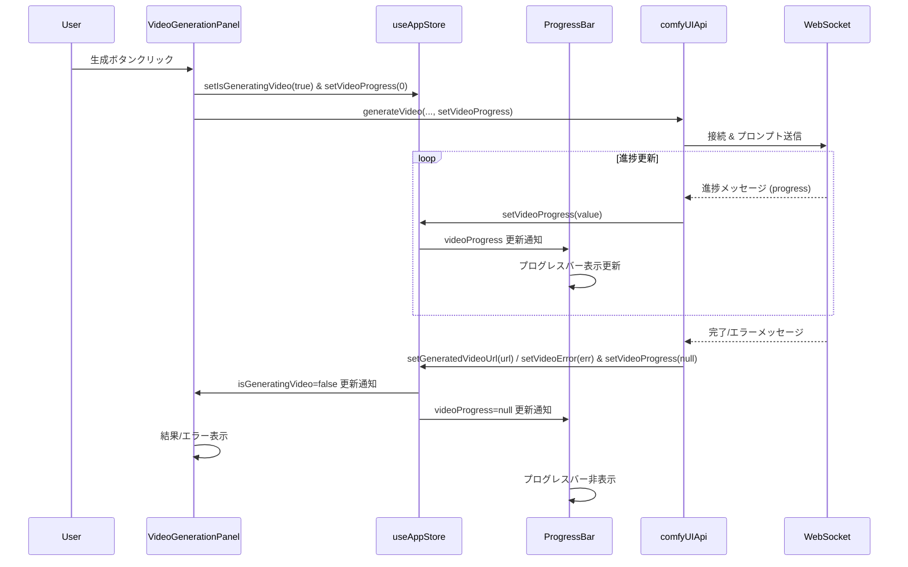

# 動画生成プログレスバー実装計画

## 目的

動画生成パネル (`VideoGenerationPanel.tsx`) に、生成処理の進捗を示すプログレスバーを追加する。

## 現状の課題

1. **状態管理:** 動画生成専用の進捗状態 (`videoProgress`) がストア (`useAppStore`) に存在しない。
2. **コンポーネント連携:**
    * `VideoGenerationPanel` から `generateVideo` API を呼び出す際に、進捗更新用のコールバック (`setVideoProgress`) を渡していない。
    * `VideoGenerationPanel` 内で `ProgressBar` コンポーネントがコメントアウトされている。
3. **`ProgressBar` コンポーネント:** 画像生成用の進捗状態 (`progress`) を直接参照しており、動画生成の進捗を表示できない。

## 対応方針

以下のステップで実装を進める。

1. **状態管理の拡張 (`src/store/useAppStore.ts`)**
    * `AppState` インターフェースに以下を追加:

    ```typescript
        videoProgress: number | null;
        setVideoProgress: (progress: number | null) => void;
        ```
    * `create` 関数内の初期状態とアクションに以下を追加:
        ```typescript
        videoProgress: null,
        setVideoProgress: (progress) => set({ videoProgress: progress }),
        ```
    * `setIsGeneratingVideo` アクションを修正し、`videoProgress` をリセットする処理を追加:
        ```typescript
        setIsGeneratingVideo: (value) =>
          set({
            isGeneratingVideo: value,
            generatedVideoUrl: null, // 既存
            videoError: null,       // 既存
            videoProgress: value ? 0 : null, // 追加: 開始時に0、終了時にnull
          }),
        ```
    * `setGeneratedVideoUrl` アクションを修正し、`videoProgress` をリセットする処理を追加:
        ```typescript
        setGeneratedVideoUrl: (url) =>
          set({
            generatedVideoUrl: url,
            isGeneratingVideo: false, // 既存
            videoProgress: null,     // 追加
          }),
        ```
    * `setVideoError` アクションを修正し、`videoProgress` をリセットする処理を追加:
        ```typescript
        setVideoError: (error) =>
          set({
            videoError: error,
            isGeneratingVideo: false, // 既存
            videoProgress: null,     // 追加
          }),
    ```

2. **`ProgressBar.tsx` の修正 (`src/components/ProgressBar.tsx`)**
    * ストアから `activeTab` と `videoProgress` を取得する。
    * 表示する進捗値を `activeTab` に応じて切り替える。

    ```typescript
        import React from "react";
        import { useAppStore } from "../store/useAppStore";

        const ProgressBar: React.FC = () => {
          const activeTab = useAppStore((state) => state.activeTab);
          const imageProgress = useAppStore((state) => state.progress);
          const videoProgress = useAppStore((state) => state.videoProgress); // 追加

          // 表示するタブに応じて進捗を選択
          const progress = activeTab === "video" ? videoProgress : imageProgress;

          console.log(`ProgressBar (${activeTab}) received progress:`, progress);

          if (progress === null || progress < 0 || progress > 1) {
            return null;
          }

          const percentage = Math.round(progress * 100);
          console.log("Calculated percentage:", percentage);

          return (
            <div className="w-full bg-gray-200 dark:bg-gray-700 rounded-full h-2.5 my-4">
              <div
                className="bg-blue-600 dark:bg-blue-500 h-2.5 rounded-full transition-all duration-150 ease-linear"
                style={{ width: `${percentage}%` }}
                role="progressbar"
                aria-valuenow={percentage}
                aria-valuemin={0}
                aria-valuemax={100}
                aria-label="生成進捗"
              ></div>
              <span className="sr-only">{percentage}% Complete</span>
            </div>
          );
        };

        export default ProgressBar;
    d```

3. **`VideoGenerationPanel.tsx` の修正 (`src/components/VideoGenerationPanel.tsx`)**

    * `ProgressBar` のインポートコメントアウトを解除:

        ```typescript
        import ProgressBar from './ProgressBar'; // コメント解除
        ```

    * `useAppStore` から `setVideoProgress` を取得:

        ```typescript
        const {
          // ... existing state ...
          setVideoProgress,
        } = useAppStore();
        ```

    * `handleGenerateClick` 内の `comfyUIApi.generateVideo` 呼び出しで `setVideoProgress` を渡す:

        ```typescript
        const result = await comfyUIApi.generateVideo(
          videoSourceImage.file,
          videoPrompt,
          videoGenerationParams,
          setVideoProgress // 追加: 第4引数として渡す
        );
        ```

    * `ProgressBar` の表示部分のコメントアウトを解除:

        ```typescript
        {/* 5. Progress Bar */}
        {isGeneratingVideo && <ProgressBar />} {/* コメント解除し、propsを削除 */}
        ```

    * 不要になった `progress`, `setProgress` 関連のコメントアウトを削除:

        ```typescript
        // import ProgressBar from './ProgressBar'; // 既存コンポーネント (WebSocket実装後に有効化) <- 削除 or 修正済
        // setProgress, // WebSocket実装後に有効化 <- 削除
        // progress, <- 削除
        // setProgress(0); // WebSocket実装後に有効化 <- 削除
        // (progressValue) => setProgress(progressValue) // WebSocket実装後に有効化 <- 削除 or 修正済
        // setProgress(null); // WebSocket実装後に有効化 <- 削除
        // {isGeneratingVideo && <ProgressBar progress={progress} />} <- 削除 or 修正済
        ```

## 処理の流れ (Mermaid)



## 次のステップ

この計画に基づき、`code` モードに切り替えて実装を開始する。
